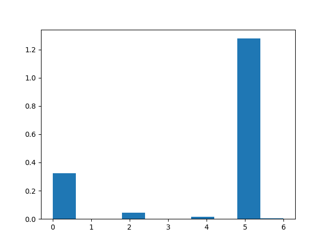
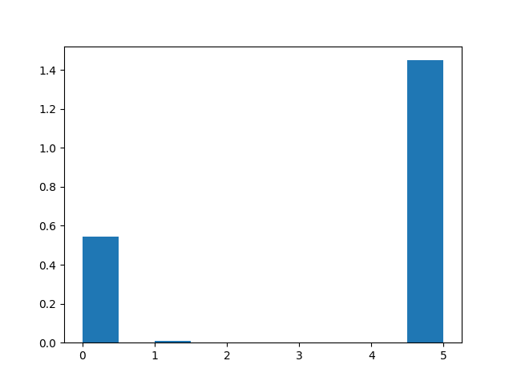

## Summarization of Scientific Texts: A Rhetorical Approach

- This project is based on [Summarizing Scientific Articles: Experiments with Relevance and Rhetorical Status](https://www.mitpressjournals.org/doi/pdf/10.1162/089120102762671936)

- The main idea behind this paper is to use a rhetorical approach for classifying different statements present in a scientific paper on basis of argumentative zoning.

- This project builds towards automatic summarisation of scientific papers. We aim to classify each sentence within the research paper as one of the 7 rhetorical categories as mentioned below.

### Annotation Based on Argumentative Zoning

Each of the statement in the paper is divided into following different categories
- **Aim** - Specific research goal of the current paper  
- **Textual** - Makes reference to the structure of the current paper    
- **Own** - (Neutral) description of own work presented in current paper: Methodology, results, discussion  
- **Background** - Generally accepted scientific background  
- **Contrast** - Statements of comparison with or contrast to other work; weaknesses of other work  
- **Basis** - Statements of agreement with other work or continuation of other work  
- **Other** - (Neutral) description of other researchers’ work  

On basis of the above rhetorical categories we do the argumentative zoning of the sentences present in the papers. 

### Features of a sentence

- **Location** - Where in the document the sentence occurs  
- **Section Structure** - Where in the section does the sentence occurs, i.e. if a sentence is a first line of the section and so on.  
- **Paragraph Structure** - Whether a sentence occurs in the start, middle or the end of a paragraph.  
- **Headline**
- **Length** - Whether the given line is a long line or not.  
- **Title** - If the words in the sentence occur in the title or not.  
- **TF IDF Score** - Whether the sentence consists of significant words or not.  
- **Voice** - What is the voice of the main verb of the sentence.  
- **Tense** - Tense of the main verb or aux verb of the sentence.  
- **Modal** - Just using the above concept we find whether there is an auxiliary verb with the main verb. If yes we give the corresponding values.  

### Approaches and Tools Used
We used existing argumentative zoning dataset and on that we created different feature vectors corresponding to each sentence, and then we trained a ***Naive Bayes*** classifier on the dataset. We did a test-train split of **0.8**

We used ***NLTK*** and ***Scikit*** for writing the classifier. Since we used scikit learn we were able to test our model with multiple distributions. 

We have used ***Naive Bayes*** with the following distributions: 
- ***Bernoulli Distribution***
- ***Gaussian Distribution***
- ***Multinomial Distribution***
- ***Complement Distribution***

### Results 

| Type      | Number of papers |
|-----------| -------------    |
| Train Dataset  | ***64 ( 80 % )***      |
| Test Dataset   | ***15 ( 20 % )***      |

| Distribution      | Accuracy |
|-----------| -------------    |
| Bernoulli  | ***84.64***      |
| Gaussian   | ***100***      |
| Multinomial  | ***80.89***      |
| Complement   | ***81.28***      |

### Plots:

---

#### Bernoulli Distribution Confusion Matrix

#### Bernoulli Distribution Histogram

---

#### Complement Distribution Confusion Matrix

#### Complement Distribution Histogram

---

#### Gaussian Distribution Confusion Matrix

#### Gaussian Distribution Histogram

---

#### Multinomial Distribution Confusion Matrix

#### Multinomial Distribution Histogram

---

### Running the code

<pre>
To Generate summary of a given file
$ <b> python src/summary.py {relative_path_of_file_from_summary.py} </b>

Example:
$ <b> python src/summary.py ../data/tagged/9405001.az-scixml </b>
</pre>

<pre>
To Train, Test and get accuracy of the classification of sentences
$ <b> python src/naive_bayes.py </b>
</pre>

<pre>
Running Flask app Locally

$ <b> sudo apt-get install python-pip </b>
$ <b> sudo pip install virtualenv </b>
$ <b> virtualenv -p python venv </b>
$ <b> source venv/bin/activate </b>
$ <b> pip install -r requirements.txt </b>
$ <b> export FLASK_APP=src/app.py </b>
$ <b> flask run </b>

</pre>

<pre>

After running the above commands, to view summary in the flask app, go the the following url
 <b> <a href="http://127.0.0.1:5000/summary/{file_name}"> http://127.0.0.1:5000/summary/{file_name} </a> </b>

Example:
 <b> <a href="http://127.0.0.1:5000/summary/9405001.az-scixml"> http://127.0.0.1:5000/summary/9405001.az-scixml </a> </b>
 
</pre>

### References

- [Automatic Argumentative-Zoning Using Word2vec](https://arxiv.org/abs/1703.10152)
- [Argumentative Zoning](https://www.cl.cam.ac.uk/~sht25/az.html)
- [Tools for automated rhetorical analysis of academic writing](http://antonetteshibani.com/tag/argumentative-zoning/)
